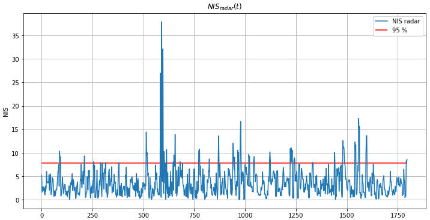

# Sensor Fusion ND: Unscented Kalman Filter
## Highway Project

In this Udacity project you will implement an Unscented Kalman Filter (UKF) to estimate the state of multiple cars on a highway using noisy lidar and radar measurements. 

For further details see Udacitys [README.md](https://github.com/udacity/SFND_Unscented_Kalman_Filter/blob/master/README.md).

## Build Instructions

1. Clone this repo.
2. Make a build directory: `mkdir build && cd build`
3. Compile: `cmake .. && make`
4. Run it: `./ukf_highway`

## Report

For a detailed analysis of the filter output have a look at the Jupyter Notebook [ukf_analysis.ipynb](./doc/ukf_analysis.ipynb).

The following map is generated,

and the *Normalized Innovation Squared (NIS)* is computed to check the consistency of the selected process noise parameters.

